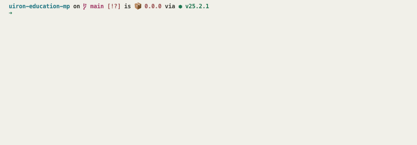

# initx-plugin-cdn-sync

A lightweight CDN sync plugin for [initx](https://github.com/initx-collective/initx).  
Upload local static assets to Tencent Cloud COS with interactive selection, diff checks, and multi-target support.



## Quick Start

### 1. Install initx

```bash
npm i -g initx
```

### 2. Install this plugin in your project

```bash
pnpm add initx-plugin-cdn-sync -D
```

### 3. Add config in project root

Create `cdn.config.ts`:

```ts
import { defineConfig } from 'initx-plugin-cdn-sync'

export default defineConfig({
  sourceDir: 'src/static',
  clients: {
    cos: {
      default: {
        bucket: 'your-bucket-name',
        region: 'ap-guangzhou',
        cdnUrl: 'https://cdn.example.com',
        basePath: '/static'
      }
    }
  }
})
```

### 4. Run upload

```bash
# upload changed files in git (default)
ix cdn
```

## What It Supports

- Upload a single file or a full directory
- Upload changed files from Git (default mode)
- Upload image files from a specific commit or commit range
- Optional cloud content diff check with `--diff`
- Multi-target uploads with `--target`
- Restore deleted/renamed-away files from commit history with `--revert`

> Current implementation supports Tencent Cloud COS upload.

## Common Commands

```bash
# single file
ix cdn ./src/static/logo.png

# directory
ix cdn ./src/static

# changed files in git (default)
ix cdn

# commit
ix cdn 9a1f6c9867e7b87444bab52eeb0a6ebe28059265

# commit range
ix cdn 4b25720...15ebc15

# specify target
ix cdn --target prod

# enable diff check
ix cdn --diff

# restore from deleted entries in commit/range
ix cdn main...HEAD --revert
```

## Credentials

If credentials are not configured, the plugin prompts during upload.

Pre-configure credentials:

```bash
ix cdn config
```

You can store multiple profiles (for example `default`, `prod`, `test`) and reference them in config.

Profile resolution order:

`clients.<type>.<client>.profile` > `targets.<name>.profile` > `default`

## Optional Multi-Target Config

```ts
import { defineConfig } from 'initx-plugin-cdn-sync'

export default defineConfig({
  sourceDir: 'src/static',
  clients: {
    cos: {
      default: {
        bucket: 'cos-default-bucket',
        region: 'ap-guangzhou',
        cdnUrl: 'https://cdn.example.com',
        basePath: '/static',
        profile: 'default'
      }
    }
  },
  targets: {
    prod: {
      type: 'cos',
      client: 'default',
      override: { basePath: '/static/prod' }
    },
    test: {
      type: 'cos',
      client: 'default',
      override: { basePath: '/static/test' }
    }
  }
})
```

## Development

```bash
pnpm install
pnpm stub
pnpm lint
pnpm tsc --noEmit
```

## Links

- [initx](https://github.com/initx-collective/initx)
- [Tencent Cloud COS](https://cloud.tencent.com/document/product/436)

## License

[MIT](./LICENSE)
